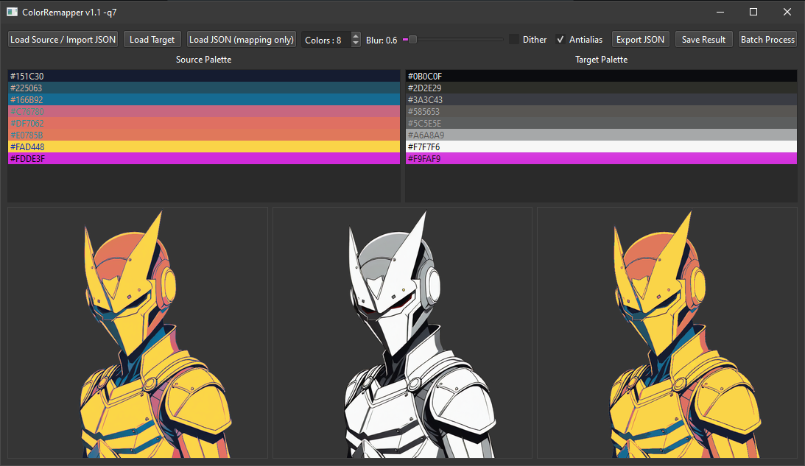

# ColorRemapper.py

_Seamlessly remap and replace color palettes between images!_

## Table of Contents

- [Overview](#overview)
- [Dependencies](#dependencies)
- [Installation](#installation)
- [Usage](#usage)
- [Features](#features)
- [Examples](#examples)
- [License](#license)
- [Contact](#contact)

## Overview

ColorRemapper.py is a desktop application that lets you transfer color palettes from one image (source) onto another image (target), with options for blurring, dithering, and antialiasing. You can also reorder or manually adjust colors, export/import mappings as JSON, and batch process folders of images.



## Dependencies

- Python 3.10 or newer
- [Pillow](https://pypi.org/project/Pillow/)
- [PySide6](https://pypi.org/project/PySide6/)

## Installation

### Windows

1. **Clone the repository:**
   ```bat
   git clone https://github.com/yourusername/ColorRemapper.git
   cd ColorRemapper
   ```
2. **Run the installation script:**  
   ```bat
   install.bat
   ```

This will create a Python virtual environment, install all dependencies, and prepare the project for use.

## Usage

1. **Launch the application:**  
   ```bat
   run.bat
   ```
2. **Follow the GUI prompts:**
   - Load a Source Image (or import an existing JSON mapping)
   - Load a Target Image
   - Adjust settings (colors, blur, dither, antialias)
   - Drag-and-drop or double-click palette entries to reorder/edit
   - Export Mapping to JSON or Save Result as PNG/JPEG
   - Batch Process a folder to apply the same mapping to multiple images

## Features

- **Fast palette extraction** using Pillow's FASTOCTREE quantization
- **Interactive GUI** with drag-and-drop palette reordering
- **Manual color editing** via color picker dialogs
- **JSON import/export** for reproducible mappings
- **Blur, dithering, antialiasing** options for fine control
- **Batch processing** to automate remapping across many files

## Examples

Original target image | After remapping with source palette
:----------------------:|:-------------------------------:
#TODO

Sample `mapping.json`:
```json
{
    "clusters": 5,
    "blur": 2.0,
    "dither": true,
    "antialias": false,
    "mapping": {
        "#FF0000": "#00FF00",
        "#0000FF": "#FFFF00",
        "#FFFFFF": "#000000",
        "#00FFFF": "#FF00FF",
        "#FFA500": "#800080"
    }
}
```

## License

This project is licensed under the Apache-2.0 License. See the [LICENSE](LICENSE) file for details.

## Contact

For questions, feedback, or contributions, please feel free to open an issue on the repository. -q7

https://github.com/yourusername/ColorRemapper

